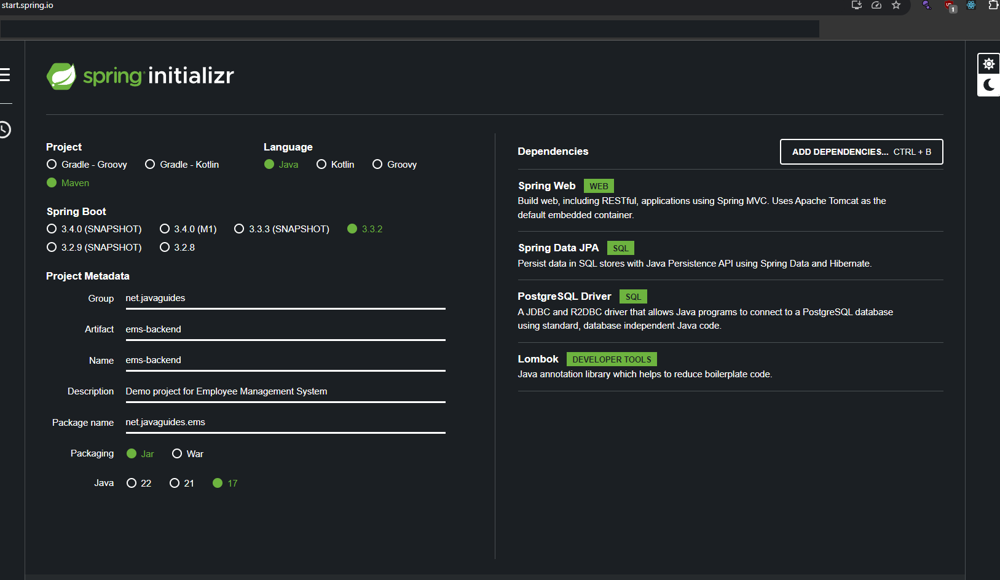

<b style="color: red;">This projects base was created from <a target="_blank" href="https://start.spring.io/">Spring IO</a></b> 

<b style="color: red;">Project:</b> Maven 
<b style="color: red;">Spring Boot:</b> 3.3.2 

<b style="color: red;">Project Metadata </b> 
<b>Group:</b> net.javaguides 
<b>Artifact:</b> ems-backend 
<b>Name:</b> ems-backend 
<b>Description:</b> Demo project for Employee Management System 
<b>Package name:</b> net.javaguides.ems 
<b>Packaging:</b> Jar 
<b>Java:</b> 17 

<b style="color: red;">Dependencies</b> 
Spring Web 
Spring Data JPA 
PostgreSQL Driver 
Lombok 

